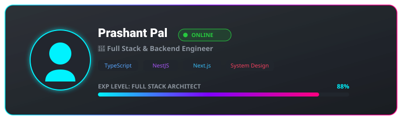
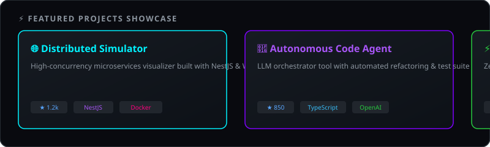

  <!-- Animated Hero Banner -->
  

    

  <!-- Floating Developer Card -->
  

   

  <!-- Neon Glowing Divider -->
  

## 👨‍💻 About Me & Hacker Console

  <!-- Interactive Animated Hacker Terminal -->
  

 

  <!-- Neon Glowing Divider -->
  

## 🪐 Tech Stack Core & Orbit

  <!-- Orbiting Tech Stack -->
  

 

  <!-- Neon Glowing Divider -->
  

## 🚀 Featured Showcase Projects

  <!-- Sliding Showcase Cards -->
  

 

  <!-- Neon Glowing Divider -->
  

## 📊 GitHub Analytics & Contributions

  

    
    
  

  

    
  

 

## 🐍 Contribution Snake Animation

  <picture>
    <source media="(prefers-color-scheme: dark)" srcset="https://raw.githubusercontent.com/palprashant156/palprashant156/output/github-contribution-grid-snake-dark.svg">
    <source media="(prefers-color-scheme: light)" srcset="https://raw.githubusercontent.com/palprashant156/palprashant156/output/github-contribution-grid-snake.svg">
    
  </picture>

 

  <!-- Animated Footer Wave & Rocket -->
  

